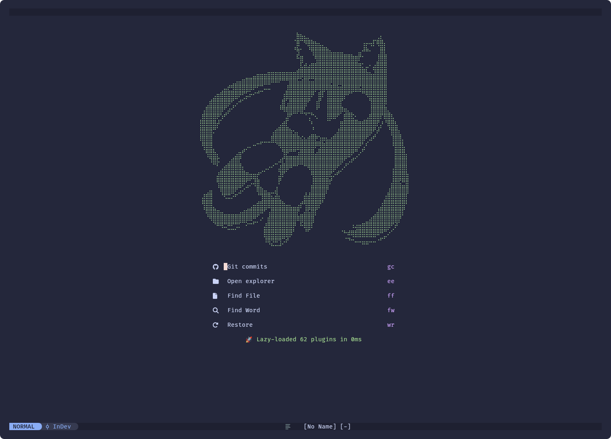

<h1 align="center">Dev Environment Files</h1>

<div class=badges align="center">
    
    <br><br>
    <a href="./LICENSE.md"></a>
    
    
    
    
    <br><br>
    
</div>
<br><br><br>

<h1 align="center">Installing</h1>

```bash
git clone https://github.com/Nighty3098/DevDotfiles.git --recurse-submodules
cd DevDotfiles
bash install.sh
```

<div align="center">
    <details>
    <summary><h1 align="center">DE</h1></summary>
    
    <br><br>
    <a href="https://github.com/Nighty3098/DevDotfiles/tree/main/.config/i3">i3 config</a><br><br>
    <a href="https://github.com/Nighty3098/DevDotfiles/tree/main/.themes/WhiteSur-custom-panel">gnome shell theme</a><br><br>
    <a href="https://github.com/Nighty3098/DevDotfiles/tree/main/.config/conky/CenteredWidget">conky widget</a><br><br>
    </details>
</div>
<br>

<div align="center">
    <details>
    <summary><h1 align="center">Terminal</h1></summary>
    
    
    <br><br>
    <a href="https://github.com/Nighty3098/DevDotfiles/tree/main/.config/nvim">nvim config</a><br><br>
    <a href="https://github.com/Nighty3098/DevDotfiles/tree/main/.config/kitty">kitty config</a><br><br>
    <a href="https://github.com/Nighty3098/DevDotfiles/tree/main/.config/htop">htop config</a><br><br>
    <a href="https://github.com/Nighty3098/DevDotfiles/tree/main/.config/neofetch">neofetch config</a><br><br>
    <a href="https://github.com/Nighty3098/DevDotfiles/blob/main/.config/starship.toml">starship config</a><br><br>
    <a href="https://github.com/Nighty3098/DevDotfiles/blob/main/.p10k.zsh">p10k config</a><br><br>
    <a href="https://github.com/Nighty3098/DevDotfiles/blob/main/.tmux.conf">tmux config</a><br><br>
    </details>
</div>
<br>

<div>
    <details align="center">
    <summary><h1 align="center">Gnome Extensions</h1></summary>

    Blur My Shell
    Clipboard indicator
    Compiz alike magic lamp effect
    Compiz windows effect
    Forge
    Hide items
    Just perfection
    Quick settings tweaker
    Rounded window corners Reborn
    TopHat
    Space Bar
    Undecorate Window
    Window title is back
    Arc menu
    Dash to dock
    User Themes

</details>
</div>
