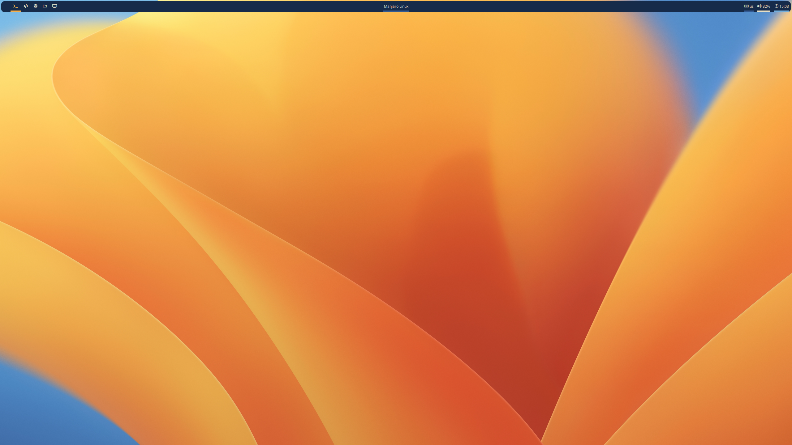
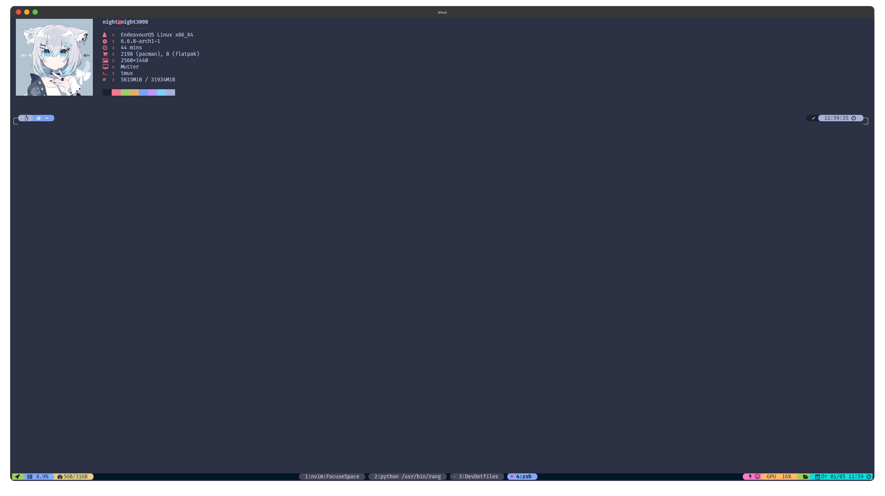
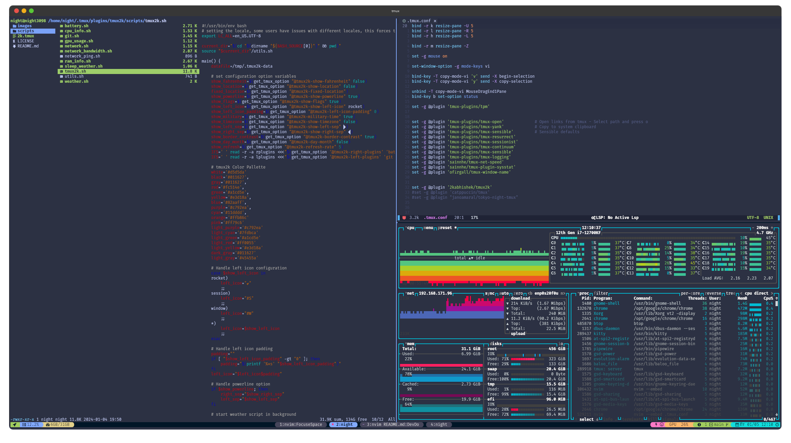

<h1 align="center">Dev Environment Files</h1>

    
    
    
    
    
      
    
      
	
	
    

 

    <h1 align="center">i3wm configuration</h1>
    
    <h3 align="center"><a href="https://github.com/Nighty3098/DevDotfiles/blob/main/.config/i3/config">i3wm configuration</a></h3>
    <h3 align="center"><a href="https://github.com/Nighty3098/DevDotfiles/blob/main/.config/polybar/config">polybar configuration</a></h3>
    <h3 align="center"><a href="https://github.com/Nighty3098/DevDotfiles/blob/main/.config/rofi/config.rasi">rofi configuration</a></h3>

 

         
	<h1 align="center">Terminal configuration</h1>
	
	<h3 align="center"><a href="https://github.com/Nighty3098/DevDotfiles/blob/main/.zshrc">ZSH configuration</a></h3>
	<h3 align="center"><a href="https://github.com/Nighty3098/DevDotfiles/blob/main/.p10k.zsh">POWERLEVEL10k configuration</a></h3>
	<h3 align="center"><a href="https://github.com/Nighty3098/DevDotfiles/blob/main/.tmux.conf">TMUX configuration</a></h3>
	<h3 align="center"><a href="https://github.com/Nighty3098/DevDotfiles/blob/main/.config/neofetch/config.conf">Neofetch configuration</a></h3>
	<h3 align="center"><a href="https://github.com/N1ght3098/DevDotfiles/tree/main/.config/nvim">NeoVim configuration</a></h3>

 

    <h1 align="center">TMUX configuration</h1>
    
    <h3 align="center">tmux plugins:</h3>
    <li><a href="https://github.com/tmux-plugins/tpm">tmux-plugins/tpm</a></li>
    <li><a href="https://github.com/tmux-plugins/tmux-yank">tmux-plugins/tmux-yank</a></li>
    <li><a href="https://github.com/tmux-plugins/tmux-sensible">tmux-plugins/tmux-sensible</a></li>
    <li><a href="https://github.com/tmux-plugins/tmux-resurrect">tmux-plugins/tmux-resurrect</a></li>
    <li><a href="https://github.com/tmux-plugins/tmux-sessionist">tmux-plugins/tmux-sessionist</a></li>
    <li><a href="https://github.com/tmux-plugins/tmux-continuum">tmux-plugins/tmux-continuum</a></li>
    <li><a href="https://github.com/tmux-plugins/tmux-logging">tmux-plugins/tmux-logging</a></li>
    <li><a href="https://github.com/sainnhe/tmux-net-speed">sainnhe/tmux-net-speed</a></li>
    <li><a href="https://github.com/sainnhe/tmux-plugin-sysstat">sainnhe/tmux-plugin-sysstat</a></li>
    <li><a href="https://github.com/ofirgall/tmux-window-name">ofirgall/tmux-window-name</a></li>
    <li><a href="https://github.com/2kabhishek/tmux2k">2kabhishek/tmux2k</a></li>

 

	<h1 align="center">NeoVim configuration</h1>
    
	<h3 align="center">nvim plugins:</h3>
        <li><a href="https://github.com/zaldih/themery.nvim">zaldih/themery.nvim</a></li>
		<li><a href="https://github.com/neovim/nvim-lspconfig">neovim/nvim-lspconfig</a></li>
		<li><a href="https://github.com/williamboman/mason.nvim">williamboman/mason.nvim</a></li>
		<li><a href="https://github.com/nvimtools/none-ls.nvim">nvimtools/none-ls.nvim</a></li>
		<li><a href="https://github.com/goolord/alpha-nvim">goolord/alpha-nvim</a></li>
		<li><a href="https://github.com/rmagatti/auto-session">rmagatti/auto-session</a></li>
		<li><a href="https://github.com/romgrk/barbar.nvim">romgrk/barbar.nvim</a></li>
		<li><a href="https://github.com/stevearc/dressing.nvim">stevearc/dressing.nvim</a></li>
		<li><a href="https://github.com/stevearc/conform.nvim">stevearc/conform.nvim</a></li>
		<li><a href="https://github.com/lewis6991/gitsigns.nvim">lewis6991/gitsigns.nvim</a></li>
		<li><a href="https://github.com/ThePrimeagen/harpoon">ThePrimeagen/harpoon</a></li>
		<li><a href="https://github.com/cdelledonne/vim-cmake">cdelledonne/vim-cmake</a></li>
		<li><a href="https://github.com/nvim-lualine/lualine.nvim">nvim-lualine/lualine.nvim</a></li>
		<li><a href="https://github.com/hrsh7th/nvim-cmp">hrsh7th/nvim-cmp</a></li>
		<li><a href="https://github.com/kylechui/nvim-surround">kylechui/nvim-surround</a></li>
		<li><a href="https://github.com/nvim-tree/nvim-tree.lua">nvim-tree/nvim-tree.lua</a></li>
		<li><a href="https://github.com/nvim-treesitter/nvim-treesitter">nvim-treesitter/nvim-treesitter</a></li>
		<li><a href="https://github.com/nvim-tree/nvim-web-devicons">nvim-tree/nvim-web-devicons</a></li>
		<li><a href="https://github.com/preservim/tagbar">preservim/tagbar</a></li>
		<li><a href="https://github.com/nvim-telescope/telescope.nvim">nvim-telescope/telescope.nvim</a></li>
		<li><a href="https://github.com/folke/lazy.nvim">folke/lazy.nvim</a></li>
        <li><a href="https://github.com/echasnovski/mini.animate">echasnovski/mini.animate</a></li>
        <li><a href="https://github.com/Exafunction/codeium.nvim">Exafunction/codeium.nvim</a></li>
        <li><a href="https://github.com/rhysd/vim-clang-format">rhysd/vim-clang-format</a></li>
        <li><a href="https://github.com/folke/noice.nvim">folke/noice.nvim</a></li>
        <li><a href="https://github.com/folke/neodev.nvim">folke/neodev.nvim</a></li>
        <li><a href="https://github.com/rcarriga/nvim-notify">rcarriga/nvim-notify</a></li>
        <li><a href="https://github.com/MunifTanjim/prettier.nvim">MunifTanjim/prettier.nvim</a></li>

