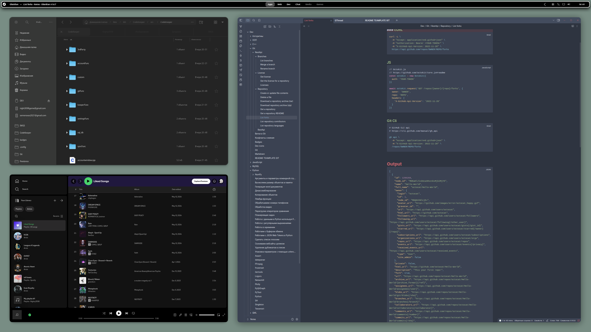
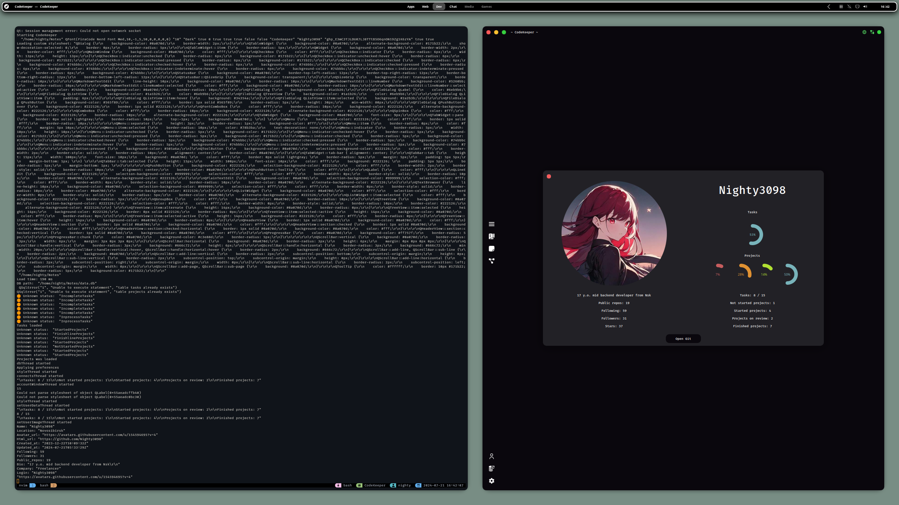
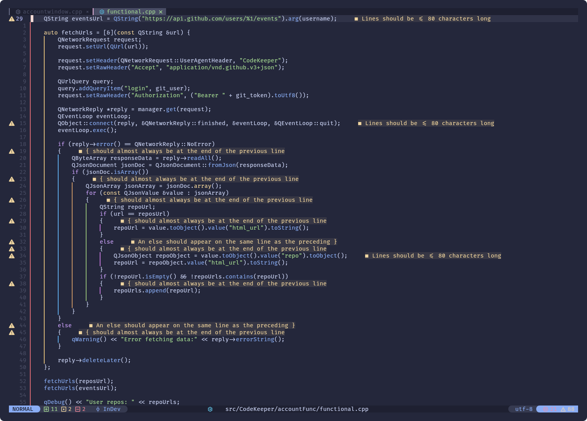

<h1 align="center">Dev Environment Files</h1>

<div class=badges align="center">
    <a href="./LICENSE.md"></a>
    
    
    
    
    <br><br>
    <a href="https://discord.gg/tnHSEc2cZv"></a><br>
    <br><br>
    
</div>
<br>


```
OS: Manjaro Linux x86_64 
DE: Gnome 
Term: kitty  
CPU: 12th Gen Intel i7-12700KF
GPU: NVIDIA GeForce RTX 4070 
Ram: 31934MiB 
Monitor: 2560x1440 
```


<div align="center">
    <h1 align="center">DE</h1>
    
    
    <br><br>
    <a href="https://github.com/Nighty3098/DevDotfiles/tree/main/.config/i3">i3 config</a><br><br>
    <a href="https://github.com/Nighty3098/DevDotfiles/tree/main/.themes/WhiteSur-custom-panel">gnome theme</a><br><br>
    <a href="https://github.com/Nighty3098/DevDotfiles/tree/main/.config/conky/CenteredWidget">conky widget</a><br><br>
</div>
<br>

<br><br><br><br><br><br>

<div align="center">
    <h1 align="center">Terminal</h1>
    
    <br><br>
    <a href="https://github.com/Nighty3098/DevDotfiles/tree/main/.config/nvim">nvim config</a><br><br>
    <a href="https://github.com/Nighty3098/DevDotfiles/tree/main/.config/kitty">kitty config</a><br><br>
    <a href="https://github.com/Nighty3098/DevDotfiles/tree/main/.config/alacritty">alacritty config</a><br><br>
    <a href="https://github.com/Nighty3098/DevDotfiles/tree/main/.config/htop">htop config</a><br><br>
    <a href="https://github.com/Nighty3098/DevDotfiles/tree/main/.config/neofetch">neofetch config</a><br><br>
    <a href="https://github.com/Nighty3098/DevDotfiles/blob/main/.config/starship.toml">starship config</a><br><br>
    <a href="https://github.com/Nighty3098/DevDotfiles/blob/main/.p10k.zsh">p10k config</a><br><br>
    <a href="https://github.com/Nighty3098/DevDotfiles/blob/main/.tmux.conf">tmux config</a><br><br>
</div>
<br>


<div align="center">
    <h1 align="center">Gnome Extensions</h1>

```
    Blur My Shell
    Clipboard indicator
    Compiz alike magic lamp effect
    Compiz windows effect
    Forge
    Hide items
    Just perfection
    Quick settings tweaker
    Rounded window corners Reborn
    TopHat
    Space Bar
    Undecorate Window
    Window title is back
    Arc menu
    Dash to dock
    User Themes
```

</div>