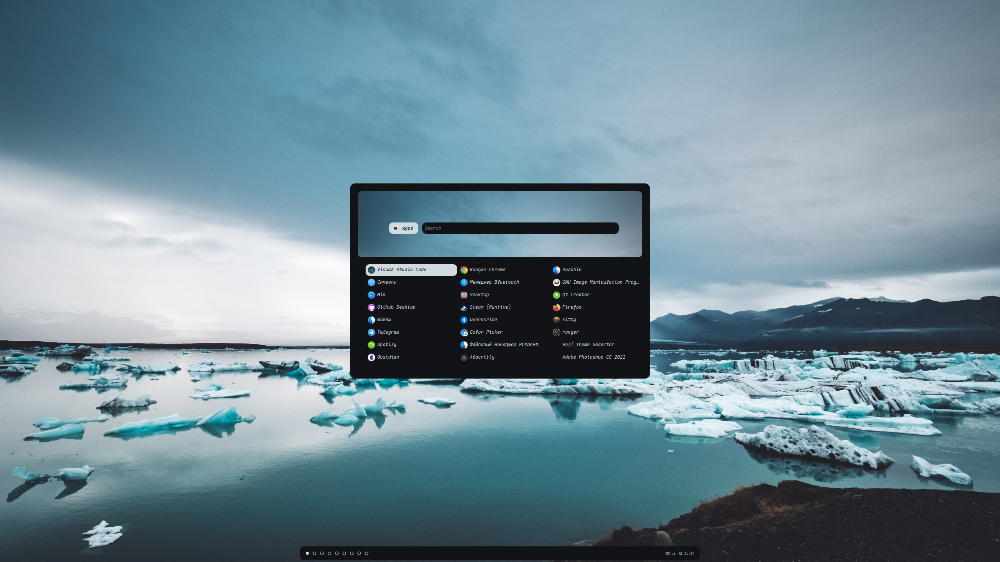
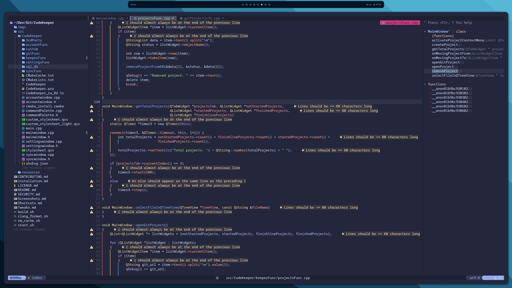
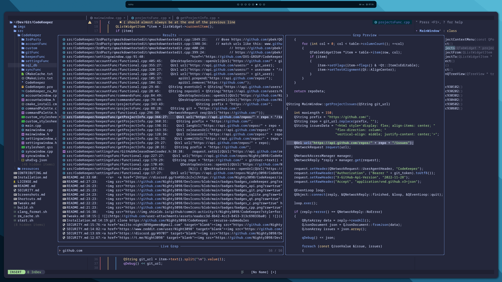
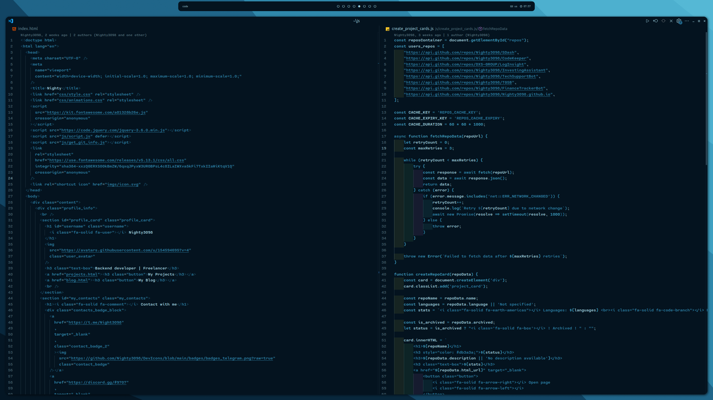
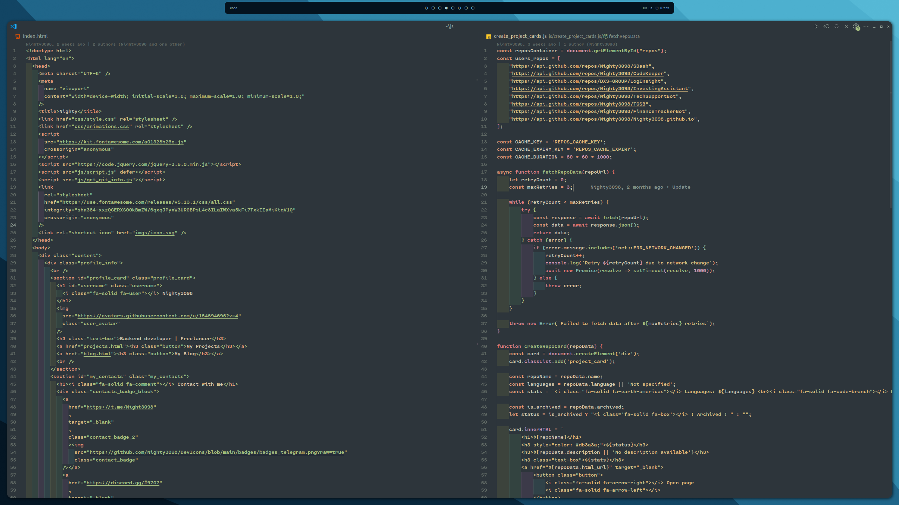
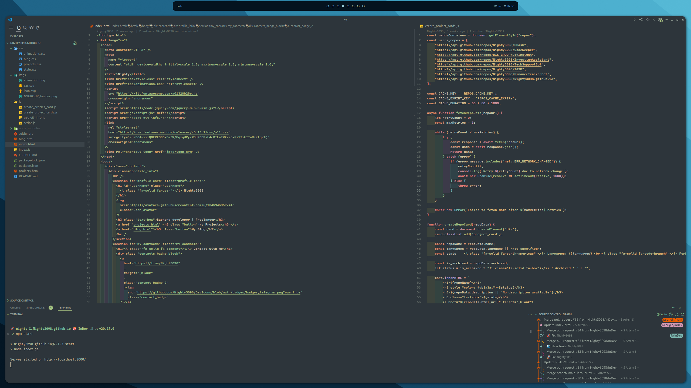

<br><br><br>
<div class=badges align="center">
    
    <br><br><br>
    
    
    
    
    <br><br>
    
</div>
<br><br><br>

<h1>Installing</h1>

```bash
git clone https://github.com/tmux-plugins/tpm ~/.tmux/plugins/tpm
git clone https://github.com/Nighty3098/DevDotfiles.git --recurse-submodules
bash install.sh
```

<div align="center">
    <summary><h1 align="center">DE</h1></summary>
    
</div>
<br><br>
<div align="center">
    <summary><h1 align="center">Neovim</h1></summary>
    
    
</div>
<br><br>
<div align="center">
    <summary><h1 align="center">Visual Studio Code</h1></summary>
    
    
    
</div>
