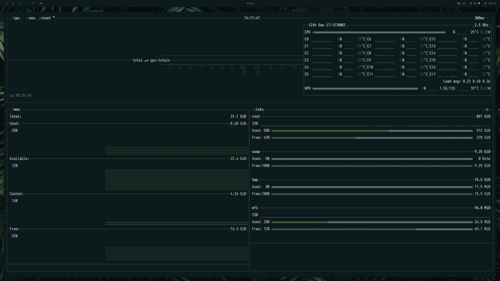
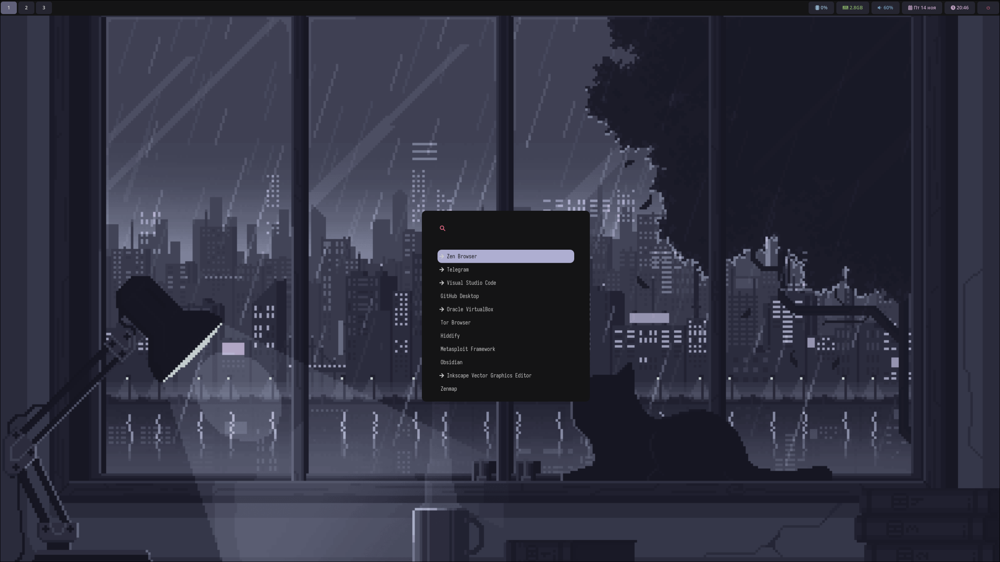
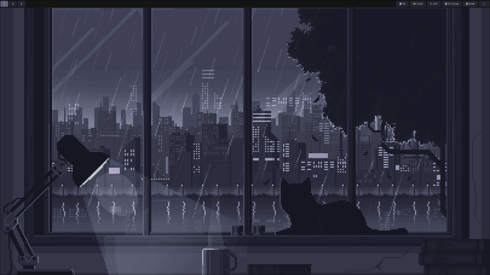
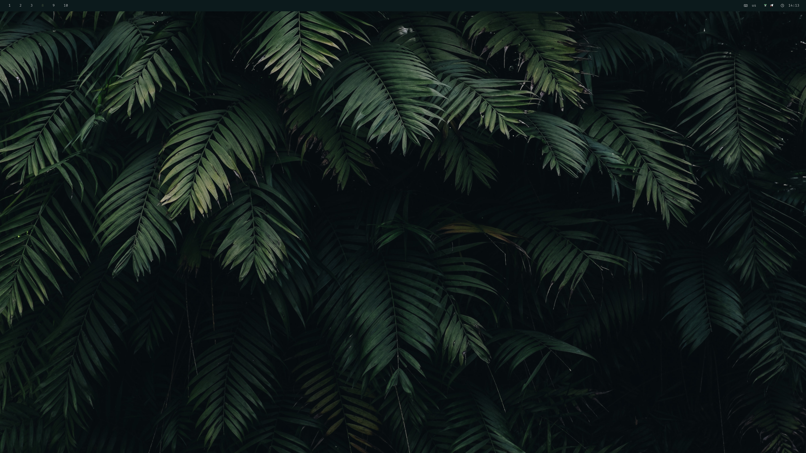
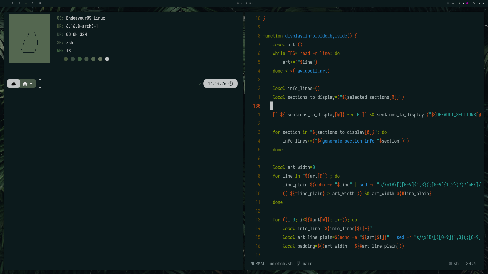
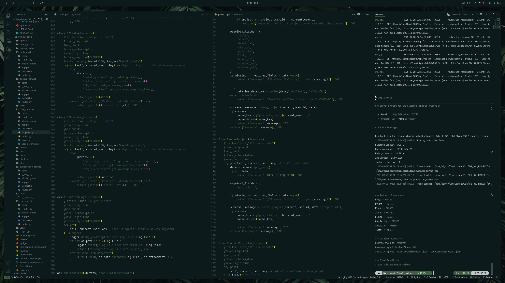
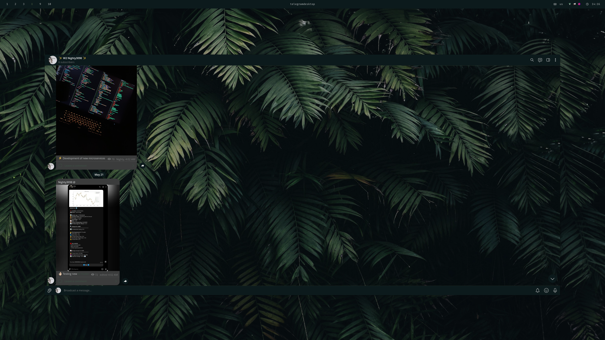

<div align="center">
    
    
    <br><br>
    
    
    <br><br>
    <a href="https://github.com/Nighty3098/nFetch"><kbd><br /> Custom system fetch <br /></kbd></a>  
    <a href="https://github.com/Nighty3098/nvim"><kbd><br /> Neovim config <br /></kbd></a>
    <br><br>
</div>

Hello there! 👋 Welcome to my collection of **i3wm** dotfiles, designed for a sleek and functional Linux desktop experience. I hope you find something useful here! 😺

## 📋 Environment Setup

Here’s a breakdown of my current setup:

- **Window Manager**: [i3wm](https://github.com/i3/i3) and [Hyprland](https://github.com/hyprwm/Hyprland) 🖼️
- **Shell**: [zsh](https://wiki.archlinux.org/index.php/zsh) 🐚 powered by [oh-my-zsh](https://github.com/ohmyzsh/ohmyzsh) and [p10k](https://github.com/romkatv/powerlevel10k)
- **Terminal**: [kitty](https://github.com/kovidgoyal/kitty) 😺
- **Panel**: [polybar](https://github.com/polybar/polybar) and [waybar](https://github.com/Alexays/Waybar) 📊 with [Iosevka NF](https://github.com/be5invis/Iosevka) for icons
- **Compositor**: [picom](https://github.com/chjj/compton) on i3wm ✨
- **Notifications**: [dunst](https://wiki.archlinux.org/index.php/Dunst) 🔔
- **File Manager**: [ranger](https://github.com/ranger/ranger) 📂
- **Editor**: [neovim](https://github.com/Nighty3098/nvim) ✍️
- **Application Launcher**: [rofi](https://github.com/davatorium/rofi) and [wofi](https://github.com/SimplyCEO/wofi) 🚀
- **System Fetch**: [mFetch](https://github.com/Nighty3098/mFetch) 📈


## 📥 Installation

⚠️ **Warning**: These scripts will overwrite existing configuration files. **Back up your current configs** before proceeding.

### Prerequisites

```bash
git clone --depth=1 https://github.com/Nighty3098/DevDotfiles.git ~/DevDotfiles && cd ~/DevDotfiles
```

### Install Dependencies

1. Install the Tmux Plugin Manager (TPM):

```bash
git clone https://github.com/tmux-plugins/tpm ~/.tmux/plugins/tpm
```

1. Run the installation script to set up configs:

```bash
bash install.sh
```

## 🔗 Links and Resources

- **Custom System Fetch**: [mFetch](https://github.com/Nighty3098/mFetch)
- **Neovim Config**: [nvim](https://github.com/Nighty3098/nvim)
- **Discord Community**: [Join us!](https://discord.gg/6xEc5WFK)

## 🖼️ Desktop Environment Preview

<div align="center">
    <h3>HYPRLAND</h3>
    
    <br /><br /><br />
    
    <br /><br /><br />
    <h3>I3-WM</h3>
    
    <br /><br /><br />
    
    <br /><br /><br />
    
    <br /><br /><br />
    
    <br /><br /><br />
    
</div>

## 🛠️ Contributing

Feel free to open issues or submit pull requests to improve this setup. Check out the [GitHub Issues](https://github.com/Nighty3098/DevDotfiles/issues) for current tasks and ideas.

Happy ricing! 🎨
